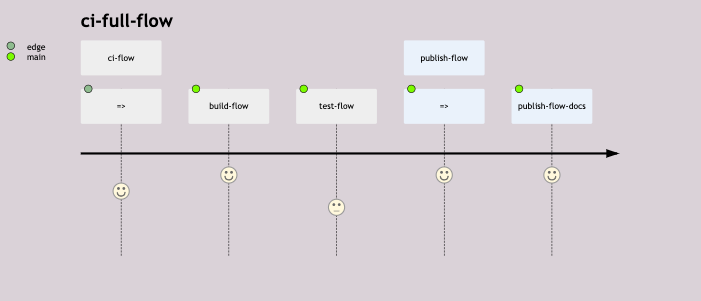
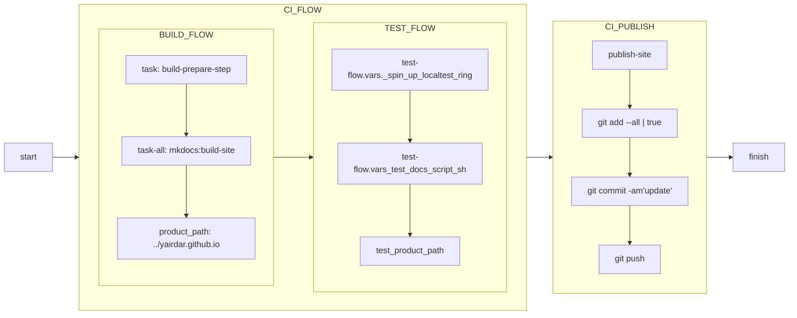
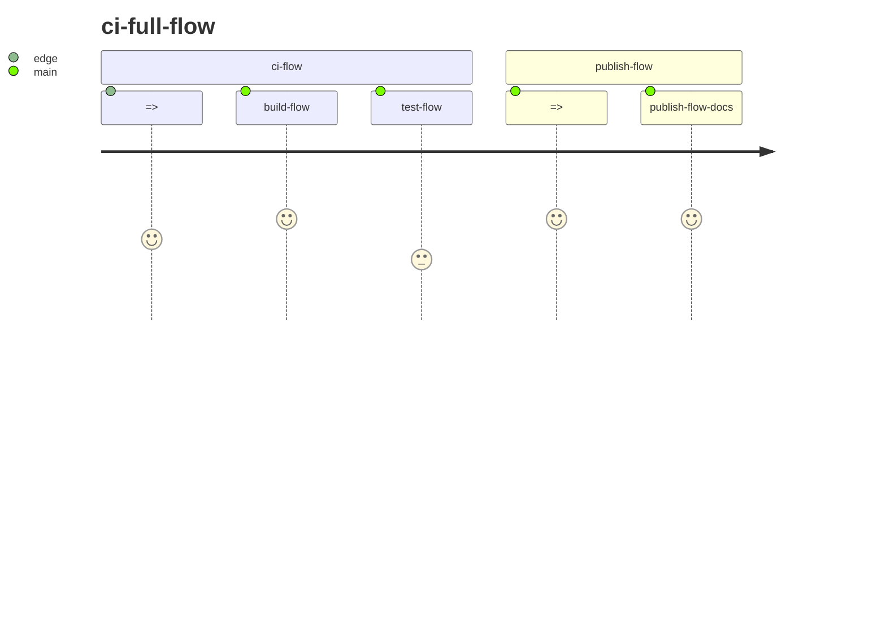

# Structure

## Project Layout Parts

### with drawio.png

### FlowCharts

```mermaid
flowchart LR
  subgraph CI_FLOW
    direction LR
    subgraph BUILD_FLOW
        direction TB
        buid-prepare[task: build-prepare-step] --> build-resolve
        build-resolve[task-all: mkdocs:build-site] --> build-product[product_path: ../yairdar.github.io]
    end
    subgraph TEST_FLOW
        direction TB
        spin_up[test-flow.vars._spin_up_localtest_ring] -->run_flows[test-flow.vars_test_docs_script_sh]
        run_flows --> test_product_path
    end
  end
  BUILD_FLOW --> TEST_FLOW
  subgraph CI_PUBLISH
    direction TB
    publish-site --> add-changes["git add --all | true"]
    add-changes --> commit-chages["git commit -am'update'"]
    commit-chages --> push-changes["git push"]
  end
  start --> CI_FLOW -->  CI_PUBLISH --> finish
```

### JourneyChart

```mermaid
journey
    title ci-full-flow
    section ci-flow
      =>: 4: edge
      build-flow: 5: main
      test-flow: 3: main
    section publish-flow
      =>: 5: main
      publish-flow-docs: 5: main
```
