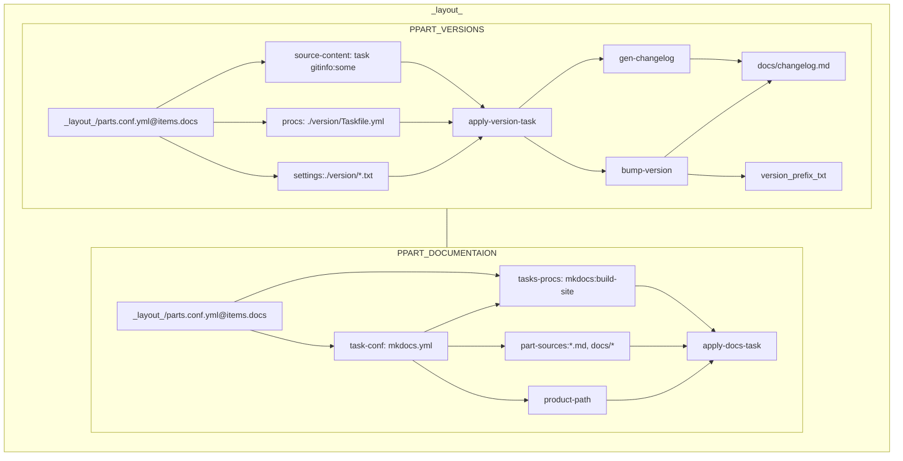

# Structure

## Project CICD Full Pipeline

```mermaid
flowchart LR
  subgraph PROJECT_PARTS[_layout_]
    subgraph PPART_VERSIONS
        direction LR
        part-ly["_layout_/parts.conf.yml@items.docs"]

        part-ly --> settings["settings:./version/*.txt"]
        part-ly --> procs-tasks["procs: ./version/Taskfile.yml"]
        part-ly --> source-content["source-content: task gitinfo:some"]
        settings --> apply-version-task
        procs-tasks --> apply-version-task
        source-content --> apply-version-task
        apply-version-task --> bump-version

        bump-version --> changelog
        bump-version --> version_prefix_txt

        apply-version-task --> gen-changelog --> changelog["docs/changelog.md"]

    end
    subgraph PPART_DOCUMENTAION
        direction LR
        part-layout --> part-procs[tasks-procs: mkdocs:build-site]
        part-layout["_layout_/parts.conf.yml@items.docs"]
            --> part-config[task-conf: mkdocs.yml]
        part-config --> part-source["part-sources:*.md, docs/*"]
        part-config --> product-path
        part-config --> part-procs

        part-procs --> result
        part-source --> result
        product-path --> result["apply-docs-task"]

    end
    PPART_VERSIONS --- PPART_DOCUMENTAION
  end
```
