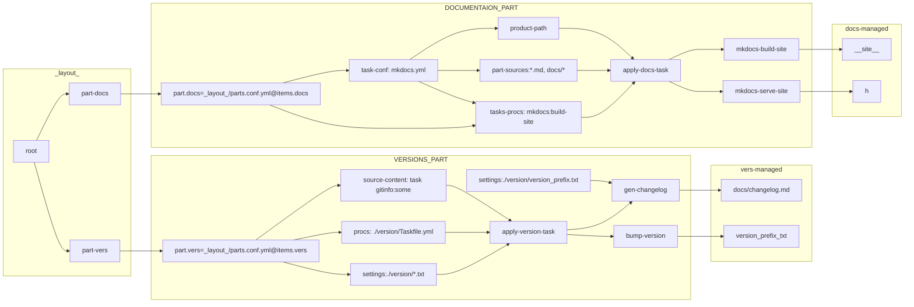
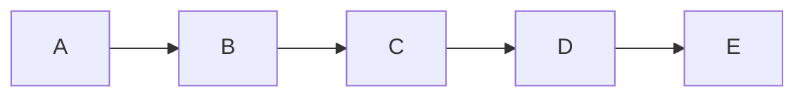

# Structure. RepoLayout

## Project CICD Full Pipeline

```mermaid
flowchart LR
  subgraph PROJECT_PARTS[_layout_]
      direction LR
      root --> part-vers
      root --> part-docs
  end
  subgraph VERSIONS_PART_MANAGED[vers-managed]
      direction LR

      changelog["docs/changelog.md"]
      version_prefix_txt
  end
  subgraph VERSIONS_PART
      direction LR
      part-ly["part.vers=_layout_/parts.conf.yml@items.vers"]

      part-ly --> settings["settings:./version/*.txt"]
      part-ly --> procs-tasks["procs: ./version/Taskfile.yml"]
      part-ly --> source-content["source-content: task gitinfo:some"]
      settings --> apply-version-task
      procs-tasks --> apply-version-task
      source-content --> apply-version-task
      apply-version-task --> bump-version
      apply-version-task --> gen-changelog

      bump-version --> version_prefix_txt
      gen-changelog --> changelog
      settings_read["settings:./version/version_prefix.txt"]--> gen-changelog
  end
  part-vers --> part-ly
  subgraph DOCUMENTAION_PART_MANAGED["docs-managed"]
      direction TB
      __site__["__site__"]
      http_res["h"]
  end
  subgraph DOCUMENTAION_PART
      direction LR
      part-layout --> part-procs[tasks-procs: mkdocs:build-site]
      part-layout["part.docs=_layout_/parts.conf.yml@items.docs"]
          --> part-config[task-conf: mkdocs.yml]
      part-config --> part-source["part-sources:*.md, docs/*"]
      part-config --> product-path
      part-config --> part-procs

      part-procs --> apply-docs-task
      part-source --> apply-docs-task
      product-path --> apply-docs-task

      apply-docs-task --> mkdocs-build-site
      apply-docs-task --> mkdocs-serve-site
      mkdocs-build-site --> __site__
      mkdocs-serve-site --> http_res

  end
  part-docs --> part-layout
```

### links sample

```mermaid
flowchart LR;
    A-->B;
    B-->C;
    C-->D;
    D-->E;
    click A "http://www.github.com" _blank
    click B "http://www.github.com" "Open this in a new tab" _blank
    click C href "http://www.github.com" _blank
    click D href "http://www.github.com" "Open this in a new tab" _blank
```
