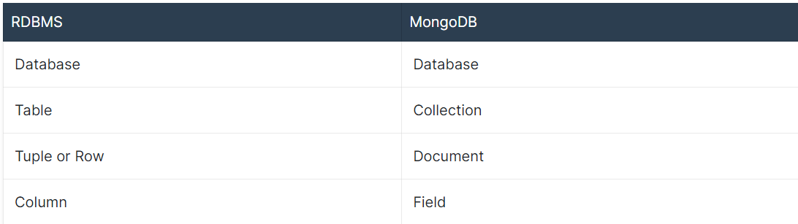
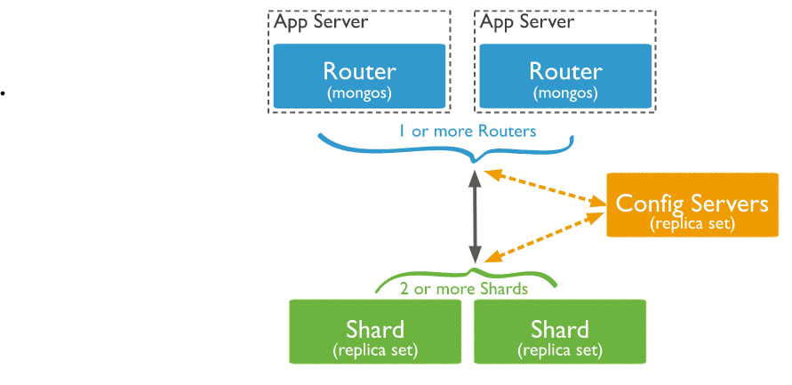

# Mongo DB

## Architectural features
- NoSQL database that is used for storing data in a key-value pair.
- Its working is based on the concept of document and collection.
- An open-source written in C++.
- Provides high availability, high performance, along with automatic scaling.

Every database has its collection of files residing in it.

### Collections
- Collections can be defined as a cluster of MongoDB documents that exist within a single database. 
- Typically, all the documents residing within a collection are meant for a comparable or related purpose.

### Documents
- A document can be defined as a collection of key-value pairs that contain dynamic schema.
- Dynamic schema - docuiments in the same collection not require to have similar feilds. A field is capable of holding various types of data 

### Relational DB management system vs. MongoDB

## Why MongoDB?
- Document-Oriented data storage, i.e., data, is stored in a JSON style format
- Replication and high availability of data.
- Indexing of values can be used to create and improve the overall search performance in MongoDB.
- MongoDB has a rich collection of queries.
- Updating of data can be done at a faster pace.

reference: https://www.w3schools.in/mongodb/overview

# More on Mongo

## Aggeregation

Data aggregation is any process whereby data is gathered and expressed in a summary form.

In Mogodb aggregation operations process multiple documents and return computed results.

To perform aggregation operations, you can use:
- Aggregation pipelines (preferred method) 
- Single purpose aggregation methods (simple but lack some capabilities)

    

## Sharding

 A method for distributing data across multiple machines. MongoDB uses sharding to support deployments with very large data sets and high throughput operations.

 A MongoDB sharded cluster consists of the following components:
 - shard: Each shard contains a subset of the sharded data.
 - mongos: The mongos acts as a query router, providing an interface between client applications and the sharded cluster.
 - config servers: Config servers store metadata and configuration settings for the cluster.

### Advantages of Sharding
- Reads and writes:

    MongoDB distributes the read and write workload across the shards in the sharded cluster, allowing each shard to process a subset of cluster operations. Both read and write workloads can be scaled horizontally across the cluster by adding more shards.
- Storage Capacity:
    
    Sharding distributes data across the shards in the cluster, allowing each shard to contain a subset of the total cluster data. As the data set grows, additional shards increase the storage capacity of the cluster.
- High Availability:
  
  The deployment of config servers and shards as replica sets provide increased availability.

  
### what is a Replica set?
A replica set in MongoDB is a group of mongod (see explanation below) processes that maintain the same data set. Replica sets provide redundancy and high availability, and are the basis for all production deployments.

**mongod** is the primary daemon (runs as a background process, rather than being under the direct control of an interactive user) process for the MongoDB system. It handles data requests, manages data access, and performs background management operations.

reference: https://www.mongodb.com/docs/manual 

