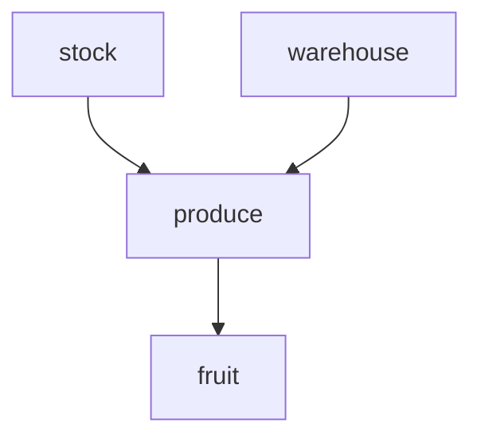
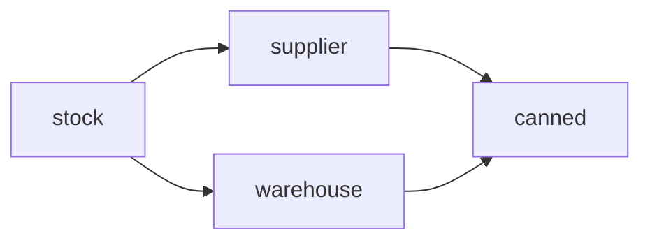
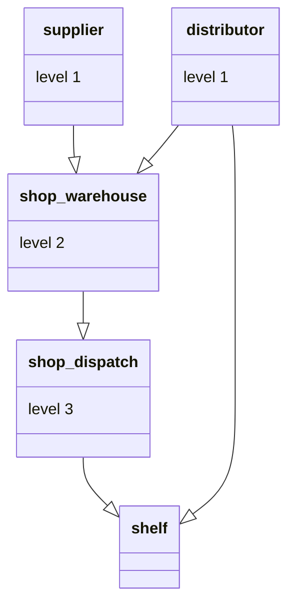

# MRO - Method Resolution Order 

[Link to reference]( https://blog.finxter.com/mro-data-abstraction-in-python/)

Refers to python 3.*

When we call an attribute or method in a class with multiple inheritances, Python follows a specific order when searching for the item we seek. That order is called the method resolution order and it complies with two rules:
1. Children will precede their parents in the sort process

2. When a child class inherits from multiple parent and grandparent classes, the search order follows the order specified in the __bases__ attribute.

To understand these rules, we have three concepts to learn. The __bases__ attribute, the __mro__ attribute, and the Python built-in [super](https://blog.finxter.com/python-super-function/) class ‘object’.

## What is the `__bases__` attribute?

The `__bases__` attribute is a Python built-in class attribute that will output the base classes of any class you call it on.



```
print(fruit.__bases__)
print(produce.__bases__)

# Result
(<class '__main__.produce'>,)
(<class '__main__.stock'>, <class '__main__.warehouse'>)
```

## What is the `__mro__` attribute?

```
class stock():
    pass

print(stock.__mro__)

# Result

(<class '__main__.stock'>, <class 'object'>)
```

## Python base object class

Python has a built-in super class called object, which is the parent class for all new classes that don’t explicitly inherit from elsewhere.


```
print(fruit.__mro__)

# Result

(<class '__main__.fruit'>, <class '__main__.produce'>, <class '__main__.stock'>, <class '__main__.warehouse'>, <class 'object'>)
```

# More complex structures



AKA diamond 

```
print(canned.__mro__)

# Result

(<class '__main__.canned'>, <class '__main__.warehouse'>, <class '__main__.supplier'>, <class '__main__.stock'>, <class 'object'>)
```

### Once your code begins to get more complex, with multiple levels of inheritance, hybrid structures and nested classes, life begins to get unwieldy.

Python is unable to resolve ambiguity or conflict as follows:



We know that a higher class can’t come before a lower class, yet that’s what we’re asking for when we created the shelf class using shelf(distributor, shop_dispatch).

```
print(shelf.level)

# Result

TypeError: Cannot create a consistent method resolution
order (MRO) for bases distributor, shop_dispatch
```

The good practice is to remove the distributor class as a parent of shelf as all attributes and methods are available through the hierarchy. 
